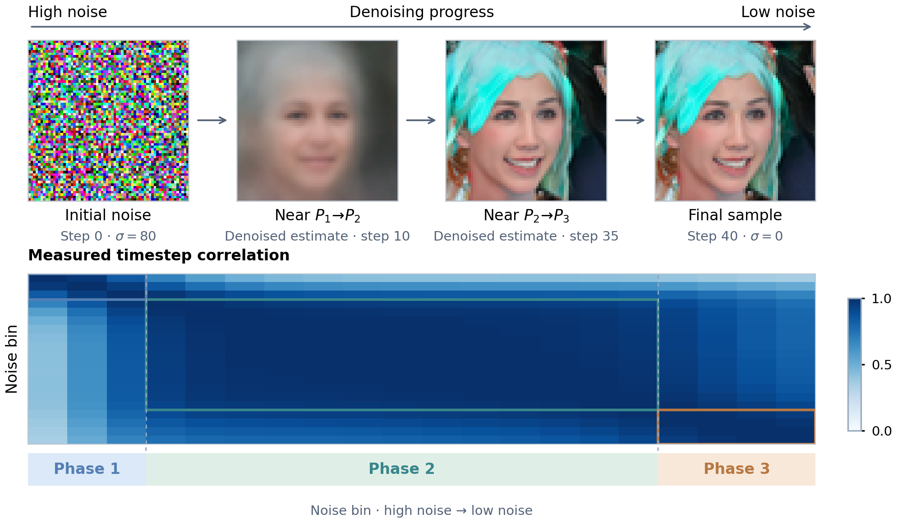
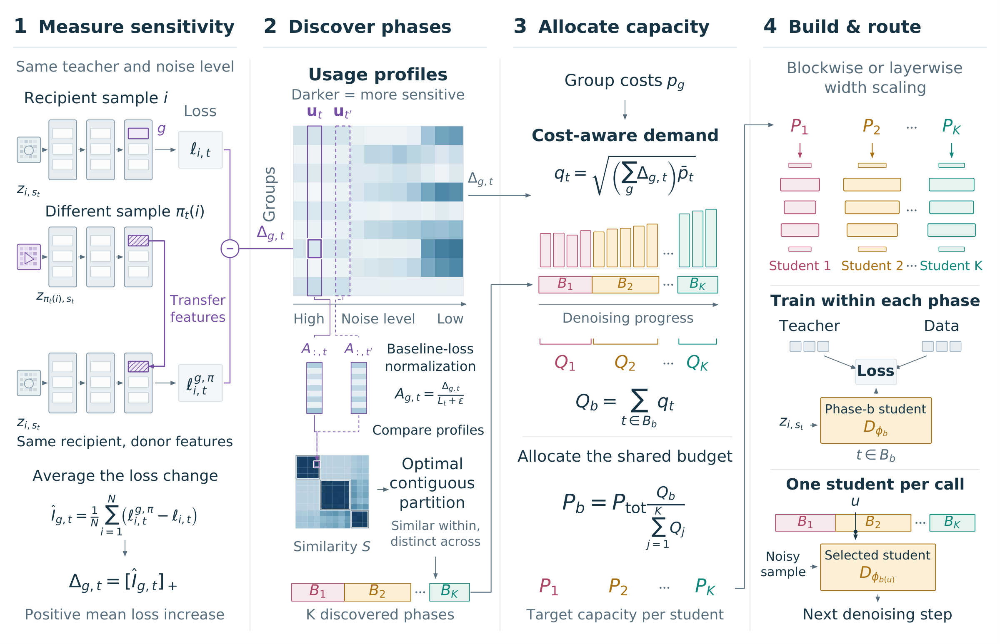

<div align="center">

# Different Noise Levels, Different Needs

### Discovering Diffusion Phases for Efficient Distillation (PACE)

[Eitan Kosman](https://github.com/ekosman)<sup>1</sup> · [Gabriele Serussi](https://github.com/GabrieleSerussi)<sup>1,2</sup> · [Chaim Baskin](https://chaimbaskin.bgu.ac.il/)<sup>1,2</sup>

<sup>1</sup> [INSIGHT Lab](https://insight.bgu.ac.il/), School of Electrical and Computer Engineering, Ben-Gurion University of the Negev · <sup>2</sup> [Decart.ai](https://research.decart.ai/)

[](https://gabrieleserussi.github.io/pace-diffusion/)
[](https://colab.research.google.com/github/GabrieleSerussi/pace-diffusion/blob/main/colab/pace_playground.ipynb)
[](https://github.com/GabrieleSerussi/pace-diffusion/actions/workflows/tests.yml)
[](#license)



</div>

A diffusion denoiser relies on different parts of itself as the noise level falls. **PACE** measures this in a pretrained teacher, groups noise levels into phases and distills one smaller student per phase. Each denoising call then runs a single student.

This repository has the code for every step, for EDM U-Nets and diffusion transformers, and the released profiles, phases, budgets and student plans of the paper's four U-Net teachers.

## Quick start

**1. Install** (Python 3.11 or 3.12; install a CUDA build of PyTorch first if you need one):

```bash
git clone https://github.com/GabrieleSerussi/pace-diffusion && cd pace-diffusion
pip install -e ".[all]"
```

**2. Check the paper's phases and budgets on a CPU**, in under a minute. The script recomputes them from the released profiles and compares 38 values with the paper:

```bash
python reproduce/cpu_phases_and_budgets.py
```

**3. Run PACE on your own EDM teacher** (GPU). The U-Net students use layers of [NVlabs/edm](https://github.com/NVlabs/edm), so clone it next to this repository first:

```bash
git clone https://github.com/NVlabs/edm ../edm && git -C ../edm checkout 008a4e5316c8e3bfe61a62f874bddba254295afb

python scripts/evaluate_parameters_edm.py --dataset cifar10 --download --model_family vp \
    --network_pkl https://nvlabs-fi-cdn.nvidia.com/edm/pretrained/edm-cifar10-32x32-cond-vp.pkl \
    --model-cache-dir checkpoints --trust-local-pickle --output_dir outputs/profile       # 1. profile
python scripts/optimize_timestep_grouping.py --matrix outputs/profile/results.json \
    --output outputs/grouping.json                                                     # 2. phases
python scripts/dry_run_capacity_allocation.py --results-json outputs/profile/results.json \
    --timestep-grouping outputs/grouping.json --allocation-results-dir outputs/allocations   # 3. budgets
python scripts/prepare_edm_distillation.py --results-json outputs/profile/results.json \
    --allocation-results-dir outputs/allocations --output-dir outputs/plans            # 4. students
```

The defaults are the paper settings, and `--help` lists every option. Then train the students with `scripts/train_edm_distillation.py` and sample with `scripts/sample_edm_distilled.py`. The [Colab notebook](https://colab.research.google.com/github/GabrieleSerussi/pace-diffusion/blob/main/colab/pace_playground.ipynb) walks through the four steps on a released teacher in about a minute, on a CPU.

## How it works



| Step | What it does | U-Net script | DiT script |
| --- | --- | --- | --- |
| 1. Profile | At each noise level, gives one group (a channel or an attention head) the activation of another example and records the rise in denoising loss | `evaluate_parameters_edm.py` | `evaluate_parameters_dit.py`, `evaluate_parameters_dit_micro.py` (pixel space) |
| 2. Discover phases | Groups neighboring noise levels with similar profiles into contiguous phases | `optimize_timestep_grouping.py` | same |
| 3. Allocate | Splits the teacher's parameter count across phases by measured demand, then across layers | `dry_run_capacity_allocation.py` | `dit_arch_to_plans.py` |
| 4. Build and route | Builds one student per phase, distills it from the teacher on its phase, and runs only that student at sampling time | `prepare_edm_distillation.py`, `train_edm_distillation.py`, `sample_edm_distilled.py` | `train_phase_students.py`, `evaluate_students.py` |

All scripts are in `scripts/`; `evaluate_edm_checkpoint.py`, `eval_composite_curve.py` and `bench_throughput.py` measure FID and throughput. The DiT scripts need [facebookresearch/DiT](https://github.com/facebookresearch/DiT) at commit `ed81ce2` (`git clone https://github.com/facebookresearch/DiT ../DiT`).

## Results

The numbers below are relative changes computed from Tables 1 and 2 of the paper, which has the full tables. A single student and the set of PACE students each target the teacher's parameter count; the single student runs in full at every denoising call, and PACE runs only the student of the current phase.

**Speed at the same budget (Table 2).** On ImageNet, PACE runs 1.97 times faster than a single DiT-XL/2 student with the same parameter budget, at nearly equal FID (+0.1%).

**PACE against TinyFusion (Table 1, diffusion transformers).**

| Dataset | Throughput | FID |
| --- | ---: | ---: |
| ImageNet | 1.36× | 3.4% lower |
| FFHQ | 1.18× | 0.6% higher |
| LSUN Bedrooms | 1.32× | 1.6% lower |

**Sizing each phase's student by measured demand (Table 2).** FID reduction against equal budgets per phase, at the same total budget.

| Model | Dataset | Phase-aware blockwise | Phase-aware layerwise (PACE) |
| --- | --- | ---: | ---: |
| DiT | ImageNet | 1.4% | 2.3% |
| DiT | FFHQ | 2.0% | 1.2% |
| DiT | LSUN Bedrooms | 1.6% | 1.4% |
| U-Net | ImageNet | 4.8% | 9.4% |
| U-Net | FFHQ | 38.6% | 42.2% |
| U-Net | LSUN Bedrooms | 8.0% | 21.4% |

Throughput changes too, because the same stored budget does not mean the same computation per call: it changes little for the DiTs and mostly falls for the U-Nets (Table 2).

## Reproducing the paper

Each experiment has one script in `reproduce/` that runs its stages in order; `DRY_RUN=1` prints the commands and `STAGES` selects stages:

```bash
DRY_RUN=1 bash reproduce/cifar10_unet.sh
STAGES="group allocate" PROFILE_JSON=artifacts/profiles/cifar10_ddpmpp_random_same_norm.json.gz bash reproduce/cifar10_unet.sh
```

[REPRODUCING.md](REPRODUCING.md) maps every table and figure to its commands and lists the datasets, checkpoints and reference statistics to provide. The released inputs are described in [artifacts/README.md](artifacts/README.md).

## Repository layout

```
pace/          the library: profiling, phase discovery, capacity allocation, students and routing
scripts/       one command-line script per step (data/ prepares datasets, paper/ holds the paper's figures and appendix tools)
reproduce/     one script per experiment of the paper, and the CPU check
artifacts/     released profiles, phases, budgets and student plans
colab/         the Colab notebook
docs/          the project page
tests/         pytest suite (tests that need EDM, DiT or FFmpeg skip without them)
```

## Using PACE with another denoiser

The steps exchange JSON files, so a new architecture only needs a profiler and a student builder. A group is any unit whose output activation can be swapped between examples; `scripts/optimize_timestep_grouping.py` reads any matrix of groups by noise levels, and `pace/capacity_allocation.py` turns a profile and its phases into phase and layer budgets. `pace/edm_distillation.py` (`NarrowSongUNet`) and `pace/dit_arch_alloc.py` (`NarrowDiT`) show how budgets become students.

## Citation

```bibtex
@misc{kosman2026pace,
      title={Different Noise Levels, Different Needs: Discovering Diffusion Phases for Efficient Distillation},
      author={Eitan Kosman and Gabriele Serussi and Chaim Baskin},
      year={2026},
      note={Preprint},
}
```

## License

The code written for PACE is under the [MIT License](LICENSE). Parts adapted from [NVlabs/edm](https://github.com/NVlabs/edm) (CC BY-NC-SA 4.0) and [facebookresearch/DiT](https://github.com/facebookresearch/DiT) (CC BY-NC 4.0), notably the variable-width students `NarrowSongUNet` and `NarrowDiT`, keep those non-commercial licences, as do the pretrained checkpoints; vendored files keep their own. [THIRD_PARTY_NOTICES.md](THIRD_PARTY_NOTICES.md) lists everything.

PACE builds on [EDM](https://github.com/NVlabs/edm), [DiT](https://github.com/facebookresearch/DiT), [Consistency Models](https://github.com/openai/consistency_models), [DiffWave](https://github.com/albertfgu/diffwave-sashimi), [clean-fid](https://github.com/GaParmar/clean-fid) and the [guided-diffusion evaluator](https://github.com/openai/guided-diffusion/tree/main/evaluations). Questions and bug reports are welcome as GitHub issues, or by email to Eitan Kosman (kosmane@post.bgu.ac.il).
